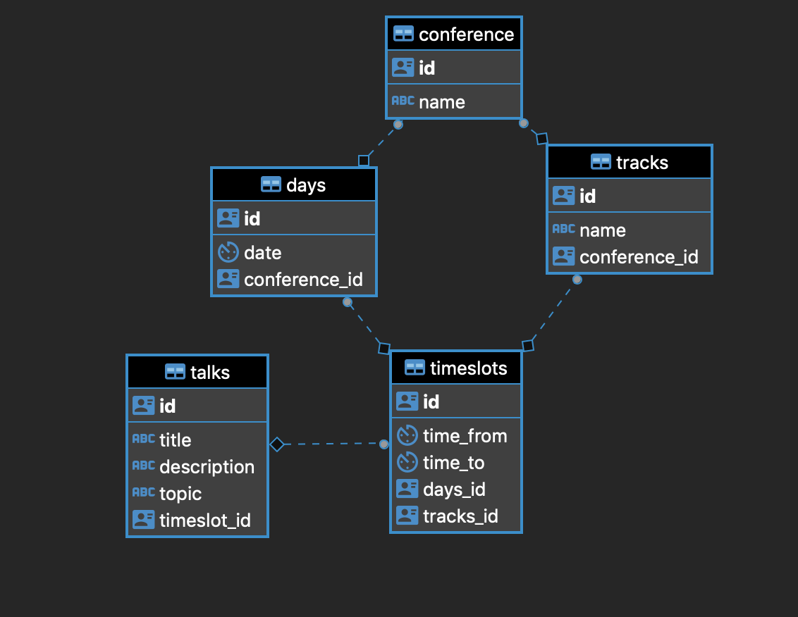

[](https://travis-ci.com/heijon17/PGR200-Eksamen)


# PGR200 Hovedinnlevering

for Jon-Martin Heiberg (heijon17) og Philip Aarseth (aarphi17)

## About
This is a simple cli tool to interface with a JDBC database through a client.


## Getting started

### Prerequisites
1. Have Maven for Java installed
2. PostgreSQL 10.6.1 (tried with 11.1, but FlyWay doesn't support it)

### Installation
1. Download a zip of the project
2. open a terminal
3. cd into the downloaded folder
4. run `mvn test` to check that everything is ok
5. run `mvn install` to install dependencies
6. run `mvn package` to export program as a .jar file
7. update innlevering.properties file with your data
**OR if you want to make a PostgreSQL user**
run the following SQL
``` SQL
CREATE DATABASE conference;
CREATE USER demouser WITH PASSWORD ‘abc123’;
GRANT ALL PRIVILEGES ON DATABASE conference TO demouser;
```

### Running the program
1. Open two terminal windows
2. CD into the downloaded folder
3. CD into server on one, then run the server Jar file with the terminal command: `Java -jar target/server-0.0.1-SNAPSHOT.jar` on the other. The terminal should now say "server started, ctrl + c to exit"
4. CD into client on the other then run the client with the terminal command: `Java -jar target/client-0.0.1-SNAPSHOT.jar
` on one and http-server-core/target on one. The terminal should now greet you with a welcome message
5. You're ready to go!
6. Try writing `insert conference -name The Most Amazing Conference 2019`
7. Write `help` to see all available commands


## Usage
Here's the syntax you need to use: 
`command table -firstColumn first value -secondColumn second value`
Everything that follows the specified column will be a part of the value for that column. No need for " or ', we handle all that nonsense for you.

The **commands** you can use:
insert, get, delete, listall & update

The **tables** you can use:
talk, conference, timeslot, date & track

These are the available **tables** with their optional **columns**:

**conference**: -name
**talk**: -title, -description, -topic, -timeslot_id 
**timeslot**: -timeFrom, -timeTo, -days_id, -tracks_id 
**date**: -date, -conference_id 
**track**: -name, -conference_id 

**date** -date should be formatted: `dd/mm/yyyy`
**timeslot** -timeFrom & -timeTo should be formatted: `hh:mm`

An example of this put together would look like this:
`insert talk -title The title -description The description comes here -topic The topic we'll be talking about`

If you are using **get, delete or update, you need to provide an ID**, find the ID by using list like so: 
* `get talk -id ID_number`
* `delete talk -id ID_number`
* `update talk -id ID_number -title New title -description New descipion -topic New topic`

You can get the ID by running listall, like this `listall talk` which returns all talks.

Here are some more examples:
``` bash
> insert talk -title The title -description The description comes here -topic The topic we are talking about
> listall talk
> get talk -id ID_number_from_listall
> update talk -id ID_number_from_listall -title New title -description New descipion -topic New topic
> update talk -id ID_number_from_listall -description New description
```


## Maven tests
```bash
> mvn test
Results :

Tests run: 33, Failures: 0, Errors: 0, Skipped: 0

[INFO] ------------------------------------------------------------------------
[INFO] Reactor Summary:
[INFO] 
[INFO] PGR200 Mappeinnlevering 0.0.1-SNAPSHOT ............. SUCCESS [  0.005 s]
[INFO] http-server-core ................................... SUCCESS [  4.117 s]
[INFO] http-client-core 0.0.1-SNAPSHOT .................... SUCCESS [  1.897 s]
[INFO] ------------------------------------------------------------------------
[INFO] BUILD SUCCESS
[INFO] ------------------------------------------------------------------------
[INFO] Total time: 6.117 s
[INFO] Finished at: 2018-11-13T01:16:24+01:00
[INFO] ------------------------------------------------------------------------

-------------------------------------------------------
 T E S T S
-------------------------------------------------------
....
> mvn install
[INFO] Replacing original artifact with shaded artifact.
[INFO] Replacing /Users/philipaarseth/Documents/GitHub/pgr200-eksamen-heijon17/http-client-core/target/http-client-core-0.0.1-SNAPSHOT.jar with /Users/philipaarseth/Documents/GitHub/pgr200-eksamen-heijon17/http-client-core/target/http-client-core-0.0.1-SNAPSHOT-shaded.jar
[INFO] Dependency-reduced POM written at: /Users/philipaarseth/Documents/GitHub/pgr200-eksamen-heijon17/http-client-core/dependency-reduced-pom.xml
[INFO] 
[INFO] --- maven-install-plugin:2.4:install (default-install) @ http-client-core ---
[INFO] Installing /Users/philipaarseth/Documents/GitHub/pgr200-eksamen-heijon17/http-client-core/target/http-client-core-0.0.1-SNAPSHOT.jar to /Users/philipaarseth/.m2/repository/no/kristiania/pgr200/http-client-core/0.0.1-SNAPSHOT/http-client-core-0.0.1-SNAPSHOT.jar
[INFO] Installing /Users/philipaarseth/Documents/GitHub/pgr200-eksamen-heijon17/http-client-core/dependency-reduced-pom.xml to /Users/philipaarseth/.m2/repository/no/kristiania/pgr200/http-client-core/0.0.1-SNAPSHOT/http-client-core-0.0.1-SNAPSHOT.pom
[INFO] ------------------------------------------------------------------------
[INFO] Reactor Summary:
[INFO] 
[INFO] PGR200 Mappeinnlevering 0.0.1-SNAPSHOT ............. SUCCESS [  0.263 s]
[INFO] http-server-core ................................... SUCCESS [  5.237 s]
[INFO] http-client-core 0.0.1-SNAPSHOT .................... SUCCESS [  2.602 s]
[INFO] ------------------------------------------------------------------------
[INFO] BUILD SUCCESS
[INFO] ------------------------------------------------------------------------
[INFO] Total time: 8.202 s
[INFO] Finished at: 2018-11-13T01:17:16+01:00
[INFO] ------------------------------------------------------------------------
```

## Troubleshooting

* BindException, possible solution: check for running clients in the terminal with command `lsof -i:10080` if it finds anything you can kill the connection with `kill PID` but change PID to what you found in the first command.


## Oppgave

### Video (fra innlevering 2)
- [x] videolink: https://youtu.be/W8xxDxO_xKQ

### Tilbakemelding
ligger i docs/
- [x] GITT-TILBAKEMELDING .md
- [x] MOTTATT-TILBAKEMELDING .md

### Evaluering av samarbeid
Samarbeidet har funket svært bra, vi har jobbet sammen i person og over slack, men rytmen på kodeutviklingen ser vi at kunne vært bedre. Det ble litt mye commit av kode som var halvferdig og det gjorde at det ble problematisk for motparten å jobbe videre med sine ting. Så når man ser tilbake burde vi ventet med å commite store endringer til ting funket som før med den nye funksjonen, enten ved å vente med å commite inn i master eller ved å bruke en annen branch.

### Evaluering av karakter
Vi bruker generics, ikke unødvendig fordi det er fancy men fordi og der det er nyttig og fordi av og til er det den beste måten å løse et problem på. Vi lar brukeren skrive inn kommandoer kontinuerlig i steden for å måtte kalle jar-filen hver gang. Vi har satt opp tester som går direkte på databasen for å sikre at funksjonene funker på den reelle databasen og vi har konfigurert Travis_ci til å spille på lag med PostgreSQL databasen. Våre 60 tester gir oss meget bra coverage på prosjektet. 90%+ på både client og server og over 60%+ på core ( i realiteten enda mer, siden bildene under er fra to forskjellige synspunkter, fra server og client). Koden er enkelt og logisk satt opp, og det ville ikke vært vanskelig å utvide prosjektet senere med mer funksjonalitet. Vi sender jsondata i body på http kallene som blir fanget opp av metoder som gjør dem om til objekter. Det gjør det veldig enkelt å legge til flere felter, eller nye tabeller senere. På grunn av løsningens og oppgavens natur føler vi at vi fortjener en særdeles bra karakter.

### Coverage


### Datamodell


